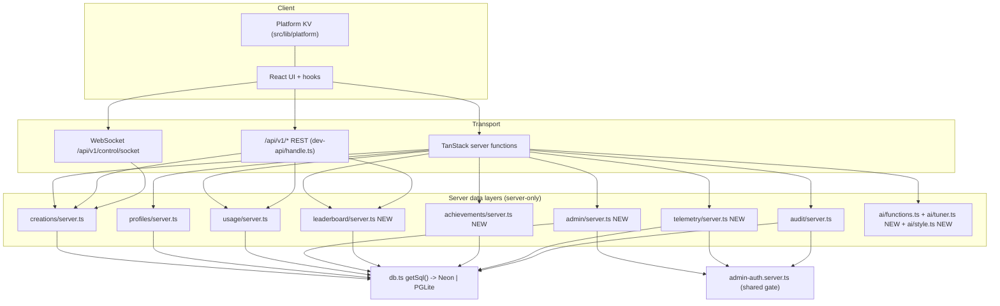

# Design Document

## Overview

This design completes the four highest-value PARTIAL areas of Helion Particle Lab plus a set of browser-runnable polish items, in the priority order the team selected. It extends the **existing** server architecture rather than replacing it: TanStack Start server functions and the `/api/v1/*` REST surface call thin `server.ts` data layers, which call `getSql()` from `src/lib/db.ts`. `getSql()` already selects **Neon** when `DATABASE_URL` is set and **PGLite** (Postgres-in-WASM) otherwise, applies `migrations/*.sql` on both backends, and normalizes result types so both return identical JSON-safe shapes. The four areas ship independently in this order:

1. **Cloud Save & Hosted-DB Persistence** (Reqs 1–3) — the persistence path already works on Neon; this area hardens it with an `updated_at`-based last-write-wins reconciliation contract, an idempotent usage flush, a client-visible "ephemeral backend" signal, and validated saves.
2. **Admin Dashboard** (Reqs 4–6) — promote the feedback-only `admin-auth.server.ts` into a shared `Admin_Service` reused across account management and analytics, all fail-closed and constant-time.
3. **Leaderboards & Achievements** (Reqs 7–8) — a global ranked board computed from stored public-creation/like rows, and server-recorded achievements keyed to the account (including a 24-hour cumulative-session milestone), replacing today's local-only XP/badges for the durable case.
4. **AI Parameter Tuning & Style Transfer** (Reqs 9–10) — turn the single one-shot grok call into a bounded closed-loop optimizer with a scored objective, and strengthen style mapping into a coherent palette/color/blend set with preserved generator + count.

Polish (the "and more"): a WebSocket `Control_Channel` that upgrades the existing polling command queue and falls back to it (Req 11), opt-in anonymous telemetry aggregated for admins (Req 12), an editorial curation row (Req 13), and an admin-wide audit-log view (Req 14).

### Standing constraints honored

- **Free 1M particle cap** — untouched. No requirement here gates particle count, and the `creationConfigSchema` `spawnCount`/`cap` clamps (up to `SYSTEM_LIMIT`) are unchanged.
- **Engine stays canvas/WebGPU** — no requirement touches `src/engine`. All work is server-side data + client hooks/UI.
- **All device I/O routes through `src/lib/platform`** — new client state (telemetry opt-in flag, ephemeral-backend indicator) reads/writes only through `kv()`.
- **Auth stays optional and non-blocking** — signed-out users get empty server sets for creations, achievements, and a public leaderboard; the simulator is never blocked (Reqs 2.5, 8.5, 7.5).
- **Every admin surface is server-side protected and fail-closed** — the existing `isAuthorizedAdmin` decision function (constant-time token compare + verified-email allowlist, deny when a database is configured and no mechanism is set) is the single gate for all admin surfaces.
- **Constant-time token compare** — the existing `timingSafeEqual`-based `safeEqual` is reused unchanged (Req 4.6).

### Explicitly excluded (rejected items)

No Stripe/billing, FFmpeg render farm, multi-GPU, headless GPU, Kubernetes, air-gapped, SSO/SAML, Sentry, A/B testing, neural rendering, depth estimation, or real AI upscaling. This spec is application-level only and does not cover deployment or infrastructure provisioning.

### Two decisions baked into requirements

- **Last-write-wins by `updated_at` (Req 2.2)** — cross-device conflicts on the same creation id resolve to the entry with the later modification timestamp. No merge, no vector clocks.
- **Suspended accounts block authenticated writes (Req 5.3)** — a suspended account's session can still read, but every authenticated write server function rejects before touching data.

---

## Architecture

The layering is unchanged; new modules slot into the existing shape.



### Backend selection and ephemeral signal (Req 1.4)

`db.ts` already exports `dbSource: "neon" | "pglite"`. A new tiny server function `getBackendInfoFn` (no auth) returns `{ ephemeral: dbSource === "pglite" }`. A client hook reads it once at boot and the UI surfaces a "storage is not persistent" indicator when `ephemeral` is true. The engine never blocks on this.

### Admin authorization as a shared gate (Reqs 4, 5.5, 6.4, 12.4, 14.4)

`admin-auth.server.ts` already contains the entire fail-closed decision (pure `isAuthorizedAdmin`) plus `assertAdmin(token)`. Today only the feedback functions call it. This design routes **every** admin surface (account management, analytics, telemetry aggregates, curation marks, audit view) through the same `assertAdmin` — one gate, one constant-time compare, one fail-closed rule. No admin surface hides behind UI only; each server function calls `assertAdmin` before any privileged query and returns empty/forbidden on denial.

### Suspended-account write gate (Req 5.3)

A new server helper `assertNotSuspended(userId)` queries the `account_status` table. It is invoked inside authenticated **write** server functions and REST write handlers (save creation, set-public, toggle-like, profile upsert, usage merge, control-queue write) after the user id is resolved and before the write. Reads are unaffected. Implemented as a dynamically-imported server-only helper so the client bundle never pulls it in.

---

## Components and Interfaces

### 1. Cloud Save & Hosted-DB Persistence (Reqs 1–3)

**`src/lib/creations/server.ts`** (extend)
- `insertCreation` and `setCreationPublic` already stamp rows; add `updated_at = now()` on `insertCreation` (the column already exists from `0004`) and on any content update.
- New `updateCreation(userId, id, name, config)` for edit-in-place, stamping `updated_at`.
- New `resolveByTimestamp(local, remote)` — a **pure** helper (no I/O) that, given two same-id creation records with `updated_at` values, returns the one with the later timestamp (Req 2.2). Ties resolve deterministically to the remote (server-authoritative) record.
- `listCreations` already returns `updated_at`-orderable rows owner-scoped; extend the SELECT to include `updated_at` so the client can reconcile.

**`src/lib/creations/types.ts`** (extend)
- Add `updated_at: string | Date` to `CreationRow`.
- Reuse `saveCreationSchema` for validation; invalid configs already `safeParse` to `null` via `normalizeCreationConfig`, so `insertCreation` returning a rejected save maps to a validation error (Req 1.5). The save server function validates with `saveCreationSchema.parse` (throws) before touching the DB.

**`src/lib/creations/use-creations.ts`** (extend, Sync_Client)
- On load, fetch server-authoritative set and present it as current (Req 2.1). Already does this.
- On a failed refresh, retain the last successfully loaded set instead of clearing to `[]` (Req 2.4) — change the `catch` to keep prior state.
- Signed-out: present empty set, never block (Req 2.5). Already does this.

**`src/lib/usage/server.ts`** (extend, idempotent flush — Req 3.3)
- The client already computes a delta via `takeDelta()` in `analytics.ts` keyed on a "flushed" snapshot. To make the server side idempotent per distinct local activity increment, `mergeAccountUsage` accepts a monotonic `activitySeq` (the client's cumulative local `seconds`/`spawns` counter at flush time). The server stores `last_activity_seq` per account and only applies a delta whose `activitySeq` exceeds the stored value, then advances it. A replayed flush with an equal-or-lower seq is a no-op. This adds an at-most-once guarantee on top of the client's snapshot logic.

**`src/lib/profiles/server.ts`** — already persists owner-scoped and returns saves/likes counts (Req 3.1, 3.4). No structural change; add the `assertNotSuspended` gate to the upsert path via its server function.

### 2. Admin Dashboard (Reqs 4–6)

**`src/lib/admin/server.ts`** (new)
- `listAccounts()` — joins Better Auth `user` rows (id, name) with per-user aggregate creation and like counts, plus suspended flag from `account_status` (Req 5.1). Computed from stored rows only.
- `suspendAccount(adminId, targetId)` / `reinstateAccount(adminId, targetId)` — upsert `account_status.suspended`, write an audit entry (Reqs 5.2, 5.4).
- `getAnalytics()` — aggregate counts: accounts, saved creations, published creations, total likes, computed via `count(*)`/`sum` over stored rows, returning `0` where no rows exist (Reqs 6.1–6.3). No seeded values.
- `assertNotSuspended(userId)` — the write gate (Req 5.3).

**`src/lib/admin/functions.ts`** (new) — server functions wrapping each, each calling `assertAdmin(token)` first; non-admin callers get a `ForbiddenError` mapped to empty result (Reqs 5.5, 6.4).

**`src/lib/feedback/admin-auth.server.ts`** — unchanged logic; now imported by admin, telemetry, curation, and audit functions too. The token arrives via query param/header exactly as the feedback route does.

### 3. Leaderboards & Achievements (Reqs 7–8)

**`src/lib/leaderboard/server.ts`** (new, Leaderboard_Service)
- `listLeaderboard(limit)` — a single grouped query over public creations + likes producing, per creator, `{ userId, displayName, score }` where `score` is computed from stored public-creation and like rows (e.g. total likes on public creations plus a small per-public-creation weight) (Req 7.3). Ordered by `score` descending, then by a deterministic secondary key (userId ascending) for stable ties (Reqs 7.1, 7.2). `limit` clamped to a configured maximum (Req 7.4). No auth required (Req 7.5).
- `rankRows(rows)` — a **pure** helper that sorts raw `{ userId, score }` rows into the ranked order, unit- and property-testable without a DB.

**`src/lib/leaderboard/functions.ts`** (new) — `listLeaderboardFn` (no auth) + a `/api/v1/leaderboard` REST route.

**`src/lib/achievements/server.ts`** (new, Achievement_Service)
- `ACHIEVEMENTS` — a static definition table: `{ id, label, metric, threshold }` (e.g. `million` at 1,000,000 peak particles, `day-session` at 86,400 cumulative seconds).
- `evaluateAchievements(current, metrics)` — a **pure** function: given the set already granted and the account's current metric values, returns the set of newly-qualifying achievement ids (first-crossing only; already-granted stay unchanged) (Reqs 8.1, 8.2, 8.3).
- `grantIfEarned(userId, metrics)` — reads granted rows, calls `evaluateAchievements`, inserts new grants idempotently (`on conflict do nothing`), returns the full granted set. Invoked from the usage-flush path so metrics (peak, cumulative seconds) trigger grants server-side.
- `listAchievements(userId)` — returns every granted achievement for the account (Req 8.4). Signed-out callers never reach this; the client hook returns an empty set when signed out (Req 8.5).

**`src/lib/achievements/functions.ts`** (new) + a client hook `use-achievements.ts` that returns `[]` when signed out and never blocks.

### 4. AI Tuning & Style (Reqs 9–10)

**`src/lib/ai/functions.ts`** (extend) — keep the single `generateLabFn` entry but branch by `mode`:
- `create` — unchanged one-shot.
- `tune` — delegate to `runTuner`.
- `style` — delegate to `mapStyle`.

**`src/lib/ai/objective.ts`** (new, pure) — `scoreCandidate(objective, params)` maps a params set to a scalar score against a request-derived objective (e.g. target energy/turbulence/brightness descriptors extracted from the prompt). Pure and deterministic given inputs.

**`src/lib/ai/tuner.ts`** (new, Tuner)
- `runTuner({ prompt, seed, evaluate, iterations })` — a bounded local optimizer (hill-climb / coordinate descent) that starts from an initial candidate, performs **at least two** evaluation iterations (Req 9.2), keeps the highest-scoring candidate, and guarantees the returned score is `>=` the initial candidate's score (Req 9.3, since it never discards the best-so-far). Each returned parameter is clamped to the simulator's valid range via `labParamsSchema` (Req 9.4). Candidate generation may consult the provider once for a starting point; if the provider is unavailable the AI_Service returns an error and never fabricates params (Req 9.5). The optimizer loop itself is pure over an injected `evaluate` function, so it is fully unit/property-testable without network.

**`src/lib/ai/style.ts`** (new, Style_Mapper)
- `mapStyle(request, modelParams)` — merges the model's suggested params into a coherent style set that always includes `palette`, `color` (colorA/colorB/tint), and `blend` consistent with the described style (Req 10.1); bounds every field through `labParamsSchema` (Req 10.2); and preserves the request's `generator` and `spawnCount` (Req 10.3). An unparseable model response returns an error (Req 10.4) — reuse `parseModelJson` returning `null`.

### 5. WebSocket Control Channel (Req 11)

**`src/lib/dev-api/socket.ts`** (new) — a WebSocket handler mounted at `/api/v1/control/socket` via Nitro's crossws support.
- On upgrade, read the bearer token from the `sec-websocket-protocol` header (browsers cannot set `Authorization` on WS); resolve it via `resolveToken`. Reject the connection when the token is invalid (Req 11.2); accept when valid (Req 11.1).
- Maintain an in-process `Map<userId, Set<peer>>` of listening labs. `POST /api/v1/control` (existing) additionally pushes to any connected peers for that account (Req 11.3), and the socket delivers commands live.
- **Fallback (Req 11.4):** where the host does not support socket upgrade, the existing `api_commands` polling queue remains the transport. Delivery is at-most-once because the GET handler already stamps `consumed_at` on each returned row. The socket path and the queue path never double-deliver: a command pushed live to a connected peer is marked consumed in `api_commands` in the same transaction, so a later poll will not re-emit it.

### 6. Telemetry (Req 12)

**`src/lib/telemetry/server.ts`** (new, Telemetry_Service)
- `recordSample(sample)` — inserts a row into `telemetry_samples` with **only** non-identifying performance fields (fps avg, p95 frame ms, dropped frames, device tier/GPU string, particle count bucket) and **no** account id or email (Req 12.3). The insert schema simply has no user column.
- `getTelemetryAggregates()` — admin-only aggregate stats (mean fps, p95 distribution) computed from stored samples (Req 12.4). Reuses `src/lib/perf/stats.ts` (`percentile`, `summarize`) for the math.

**`src/lib/telemetry/opt-in.ts`** (new, client) — reads/writes an opt-in flag through `kv()`. The submit path checks the flag and only submits when opted in (Reqs 12.1, 12.2). Submission goes through a no-auth server function/REST route since samples are anonymous.

### 7. Editorial Curation (Req 13)

**`src/lib/creations/server.ts`** (extend)
- `listFeatured()` — returns only creations marked featured AND `is_public = true` (Reqs 13.1, 13.4).
- Admin marks live in `admin/server.ts`: `setFeatured(adminId, creationId, featured)` sets `creations.featured` and writes an audit entry on set (Reqs 13.2, 13.3).

### 8. Admin Audit View (Req 14)

**`src/lib/audit/server.ts`** (extend)
- `listAllAudit(limit)` — returns audit entries across **all** accounts ordered by `created_at` descending (Req 14.1), clamped to a configured maximum (Req 14.3). Admin-only via `assertAdmin` in its server function (Req 14.4).
- `writeAudit` already exists; account-management and curation actions call it (Req 14.2).

---

## Data Models

All schema changes go in **one new migration** `migrations/0009_completion.sql` (the next sequential number; both appliers order by basename). No changes to existing tables' semantics beyond additive columns. Existing `creations.updated_at`, `usage_stats`, `audit_logs`, and `api_commands` are reused.

```sql
-- migrations/0009_completion.sql (additive only; no seed rows)

-- Curation: featured mark on public creations (Req 13).
alter table creations
  add column if not exists featured boolean not null default false;
create index if not exists creations_featured_idx
  on creations (created_at desc) where featured = true and is_public = true;

-- Suspended accounts (Req 5.2/5.3/5.4).
create table if not exists account_status (
  user_id text not null primary key,
  suspended boolean not null default false,
  updated_at timestamptz not null default now()
);

-- Server-recorded achievements (Req 8).
create table if not exists achievements (
  user_id text not null,
  achievement_id text not null,
  granted_at timestamptz not null default now(),
  primary key (user_id, achievement_id)
);
create index if not exists achievements_user_idx on achievements (user_id);

-- Idempotent usage flush guard (Req 3.3).
alter table usage_stats
  add column if not exists last_activity_seq bigint not null default 0;

-- Anonymous performance telemetry (Req 12) — NO user column by design.
create table if not exists telemetry_samples (
  id text not null primary key,
  fps_avg real not null,
  frame_ms_p95 real not null,
  dropped_frames integer not null default 0,
  particle_bucket integer not null default 0,
  device_tier text not null default '',
  created_at timestamptz not null default now()
);
create index if not exists telemetry_created_idx on telemetry_samples (created_at desc);
```

### Key TypeScript shapes (client-safe, no server imports)

```ts
// creations/types.ts — extend CreationRow
interface CreationRow {
  id: string; user_id: string; name: string;
  config: CreationConfig;
  created_at: string | Date;
  updated_at: string | Date;   // NEW — reconciliation key (Req 2.2/2.3)
  is_public: boolean;
  featured?: boolean;          // NEW (Req 13)
}

// leaderboard/types.ts
interface LeaderboardEntry { userId: string; displayName: string; score: number; rank: number; }

// achievements/types.ts
interface AchievementDef { id: string; label: string; metric: "peak" | "seconds"; threshold: number; }
interface GrantedAchievement { id: string; grantedAt: string | Date; }

// telemetry/types.ts — the ONLY fields ever stored (Req 12.3): no id/email
interface PerfSampleInput { fpsAvg: number; frameMsP95: number; droppedFrames: number; particleBucket: number; deviceTier: string; }

// admin/types.ts
interface AdminAccount { id: string; displayName: string; creations: number; likes: number; suspended: boolean; }
interface AdminAnalytics { accounts: number; savedCreations: number; publishedCreations: number; totalLikes: number; }
```

### Server-layer REST surface changes (`src/lib/dev-api/handle.ts`)

- `GET /api/v1/leaderboard` — public ranked board (Req 7.5).
- `GET /api/v1/control/socket` — WebSocket upgrade (Req 11); existing `POST/GET /api/v1/control` polling retained as fallback (Req 11.4).
- Write handlers (`POST /creations`, control write) gain the `assertNotSuspended` gate (Req 5.3).
- The `/meta` notes string is updated to mention the WebSocket channel now exists (with polling fallback).

---

## Correctness Properties

*A property is a characteristic or behavior that should hold true across all valid executions of a system — essentially, a formal statement about what the system should do. Properties serve as the bridge between human-readable specifications and machine-verifiable correctness guarantees.*

Property-based testing applies to the **pure-logic** parts of this design: the timestamp reconciliation helper, the idempotent usage-flush merge, leaderboard ranking, achievement evaluation, the tuner's monotonic-improvement guarantee, parameter clamping, and style-field preservation. It does **not** apply to the DB wiring, admin authorization plumbing, WebSocket transport, or REST routing — those are covered by example-based unit/integration tests (see Testing Strategy). The pure decision function `isAuthorizedAdmin` already has comprehensive example-based tests and is not re-derived here.

### Property 1: Last-write-wins picks the later timestamp

*For any* two creation records sharing an id with distinct `updated_at` values, `resolveByTimestamp` returns the record whose `updated_at` is later; when the timestamps are equal it deterministically returns the remote (server-authoritative) record.

**Validates: Requirements 2.2**

### Property 2: A save records a modification timestamp

*For any* saved creation, the stored row has a non-null `updated_at` that is greater than or equal to its `created_at`.

**Validates: Requirements 2.3**

### Property 3: Usage merge adds a delta at most once per activity increment

*For any* sequence of usage flushes carrying non-decreasing `activitySeq` values, applying the sequence (including arbitrary replays of the same `activitySeq`) yields account totals equal to applying only the strictly-increasing subsequence exactly once — a replayed or stale flush never increases totals.

**Validates: Requirements 3.3**

### Property 4: Usage merge is monotonic and non-negative

*For any* current totals and any delta with non-negative fields, the merged totals are greater than or equal to the current totals in every counter, and `peak` equals the maximum of the two peaks.

**Validates: Requirements 3.2**

### Property 5: Leaderboard ordering is non-increasing and stable

*For any* set of creator score rows, `rankRows` returns entries ordered by score non-increasing, and any two entries with equal scores appear in the deterministic secondary order (userId ascending), yielding a stable total order.

**Validates: Requirements 7.1, 7.2**

### Property 6: Leaderboard respects the maximum size

*For any* set of creator score rows and any configured maximum, the returned board contains at most that maximum number of entries.

**Validates: Requirements 7.4**

### Property 7: Achievement evaluation grants on first crossing and is idempotent

*For any* already-granted set and any metric values, `evaluateAchievements` returns exactly the achievement ids whose threshold the metrics meet and that are not already granted; re-running with the union of granted ids and the same or higher metrics returns an empty new-grant set (already-granted achievements are never re-granted and never removed).

**Validates: Requirements 8.1, 8.2, 8.3**

### Property 8: Tuner returns a candidate no worse than its start

*For any* prompt-derived objective and any initial candidate, `runTuner` performs at least two evaluation iterations and returns a candidate whose objective score is greater than or equal to the initial candidate's score.

**Validates: Requirements 9.1, 9.2, 9.3**

### Property 9: Tuner and Style outputs are within valid parameter ranges

*For any* returned parameter set from `runTuner` or `mapStyle`, every parameter lies within the simulator's valid range for that parameter (i.e. equals what `labParamsSchema` would coerce it to).

**Validates: Requirements 9.4, 10.2**

### Property 10: Style mapping preserves generator and count and includes style fields

*For any* style request, `mapStyle` returns a parameter set whose generator kind and spawn count equal those supplied in the request, and which includes populated `palette`, color (colorA/colorB/tint), and `blend` fields.

**Validates: Requirements 10.1, 10.3**

### Property 11: Curated row contains only featured public creations

*For any* set of creations, `listFeatured` returns only creations that are both marked featured and public, and excludes every non-public creation.

**Validates: Requirements 13.1, 13.4**

### Property 12: Telemetry samples never carry identity

*For any* recorded telemetry sample, the stored row contains only the non-identifying performance fields and no account id or email field.

**Validates: Requirements 12.3**

---

## Error Handling

- **Validation failures (Req 1.5, 10.4):** `saveCreationSchema.parse` throws on invalid save input before any DB write; the server function surfaces a validation error and no row is stored. `normalizeCreationConfig` returning `null` on a stored/garbage config makes reads degrade rather than crash. `parseModelJson` returning `null` yields `{ ok: false, error }` from the AI service.
- **AI provider unavailable (Reqs 9.5, 5-style 10.4):** missing `XAI_API_KEY` or a non-OK/unparseable response returns `{ ok: false, error }`. The tuner and style mapper never fabricate parameters on provider failure.
- **Sync fetch failure (Req 2.4):** the `use-creations` `catch` retains the last loaded set and preserves local unsaved edits instead of clearing to `[]`.
- **Admin denial (Reqs 4.3–4.5, 5.5, 6.4, 12.4, 14.4):** `assertAdmin` throws `ForbiddenError` (status 403); server functions map it to an empty list / forbidden result — never a fabricated row.
- **Suspended account write (Req 5.3):** `assertNotSuspended` throws before the write; the write server function returns a failure result and no data changes. Reads still work.
- **Backend unavailable / ephemeral (Req 1.4):** `getBackendInfoFn` reports `ephemeral: true` on PGLite so the client can warn; best-effort side tables (`audit_logs`, `telemetry_samples`) already swallow "table missing" on stale processes.
- **WebSocket auth failure (Req 11.2):** an invalid/missing bearer token closes the socket immediately with a 4401-style close code; the client falls back to polling.

---

## Testing Strategy

The project runs tests via `node --test` (with `--experimental-strip-types` for `.ts`) for pure logic and PGLite round-trips, and `vitest run` for a few engine suites (see `package.json`). New suites follow the **existing** conventions:

- **Pure-logic unit + property tests** run under `node --test` using the PGLite glob loader hook (`register("../feedback/pglite-glob-loader.mjs", ...)`) when they touch the DB, exactly like `creations.test.ts`. No DB mocking, no seeded rows.
- **Property-based testing:** the repo has no PBT library today. Add **`fast-check`** as a dev dependency (the standard choice for TypeScript) and use it for the 12 properties above; do **not** hand-roll a generator framework. Each property test runs a **minimum of 100 iterations** and is tagged with a comment: `// Feature: helion-completion, Property N: <text>`.

### Property tests (fast-check, ≥100 runs each)
- Properties 1–12 map one-to-one to a `fast-check` property, keyed to the pure helpers: `resolveByTimestamp`, `mergeAccountUsage` math (extracted pure), `rankRows`, `evaluateAchievements`, `runTuner` (with an injected deterministic `evaluate`), `labParamsSchema` clamping, `mapStyle`, `listFeatured` filter (pure predicate), and the telemetry insert shape.

### Example-based unit tests
- `resolveByTimestamp` concrete tie case; `evaluateAchievements` exact 1M and 24-hour boundaries; tuner returns the seed when no candidate improves; style mapper on an unparseable model response returns an error.

### Integration tests (real PGLite, 1–3 examples — NOT property tests)
- Creation save/list/update round-trip carries `updated_at` (Reqs 1.1–1.3, 2.1, 2.3).
- Usage flush idempotency against a real `usage_stats` row with `last_activity_seq` (Req 3.3).
- Admin: `listAccounts` aggregates real rows; `getAnalytics` returns `0` on an empty store and true counts otherwise (Reqs 5.1, 6.1–6.3); non-admin caller gets empty/forbidden (Reqs 5.5, 6.4).
- Suspend → authenticated write rejected → reinstate → write allowed (Reqs 5.2–5.4).
- Leaderboard from real public-creation/like rows is non-increasing and stable (Reqs 7.1–7.3).
- Achievements: metric crossing grants once and persists across a re-read (Reqs 8.1–8.4).
- Curation: featured public creation appears; non-public excluded (Reqs 13.1, 13.4).
- Audit: an admin action writes an entry; `listAllAudit` returns it newest-first, capped (Reqs 14.1–14.3).
- Admin authorization is fully covered by the existing `admin-auth.test.ts` example suite (Req 4); constant-time compare (Req 4.6) is exercised there.

### WebSocket / transport tests (example-based, NOT property tests)
- A valid bearer token is accepted, an invalid one rejected (Reqs 11.1, 11.2) — tested against the auth resolution path with a stub peer.
- A queued command is delivered at most once: polling GET marks `consumed_at`; a second poll returns nothing (Req 11.4) — a PGLite integration test on `api_commands`.
- Live push + queue never double-deliver (Req 11.3/11.4) — an example test asserting a command pushed to a connected peer is marked consumed.

**Rationale for the property/example split:** the DB persistence, admin gate wiring, WebSocket transport, and REST routing are I/O and external-service behavior — 100 iterations add no value there, so they use 1–3 representative examples. The reconciliation, merge math, ranking, achievement evaluation, optimizer monotonicity, parameter clamping, and style preservation are pure functions whose behavior varies meaningfully with input, so they get property-based tests.
